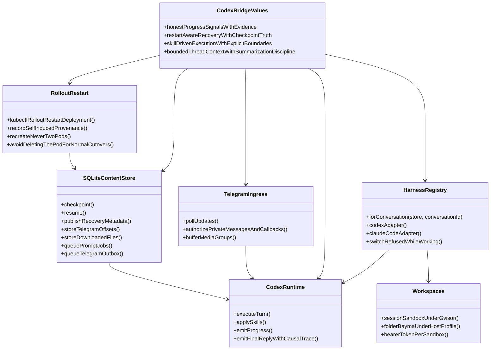
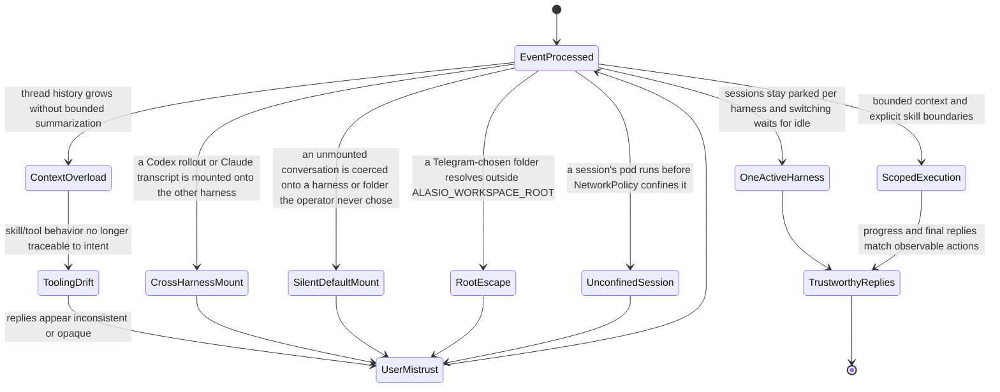

## Concept Atlas
```mermaid
mindmap
  root((alasio))
    Service selection
      alasio drives two harnesses Codex app-server and Claude Code through the Claude Agent SDK behind one harness adapter boundary
      `/service` shows the active harness and both parked session pointers and switches with `Use Codex` or `Use Claude` buttons or `/service codex` and `/service claude`
      each Telegram conversation has at most one active harness and switching is refused while a turn is active or prompts are queued
      conversations are neutral by default so until the operator mounts a service through `/service` every prompt `/start` and harness-scoped control is answered only with the service picker and nothing is queued
      the folder is the layer after the service so once a service is mounted `/workspace` must choose or create the folder the harness works in before any prompt is queued and mounting a service chains straight into the folder picker
      `/workspace` lists top-level folders under `ALASIO_WORKSPACE_ROOT` with git repositories first and `/workspace <name>` mounts one while `/workspace new <name>` creates a git-initialized folder directly under the root
      every folder chosen from Telegram is canonicalized and must stay under the workspace root so symlink and dot-dot escapes are refused and only existing directories mount
      sessions belong to one service and one folder so switching folders parks both harness session pointers and restores whichever were parked for the chosen folder and switching is refused while a turn is active or prompts are queued
      sessions are owned by one harness so the Sessions New Session Rewind and resume controls only ever enumerate and mount the active harness's own session store
      switching parks the current harness session pointer and re-activates the other harness's parked pointer instead of translating sessions across harnesses
      Claude Code turns use the login in alasio's home or the long-lived `claude setup-token` token the chart gives as CLAUDE_CODE_OAUTH_TOKEN from alasio.claude.existingSecret so the operator's Claude Code account is used without an API key
      each harness sees the MCP servers configured for it in alasio's home plus bayma which in a folder workspace is a Sandbox of its own per conversation and harness and in a session filesystem is the session's own Sandbox
      a folder workspace needs the chart's host profile which mounts what the operator chose from the node into alasio and each folder bayma and makes alasio's home the operator's own so the harnesses use their logins sessions and configuration and without it a folder's turn fails saying the deployment offers no folder workspaces
      a session filesystem is an empty workspace of its own made from `/workspace` with or without internet and offered whenever the chart renders the sessions template which it does by default
      `/goal` remains Codex-only because Claude Code has no thread goal primitive and the command says so while Claude Code is active
      `ALASIO_DEFAULT_HARNESS` is unset by default and optionally pre-mounts codex or claude on newly created conversations so they skip the picker
      `WORKING_DIRECTORY` is unset by default and optionally pre-mounts one folder on new conversations and on conversations that predate per-conversation folders so existing deployments keep working unchanged
      `ALASIO_WORKSPACE_ROOT` defaults to alasio's home and bounds every folder the picker may list mount or create and the chart sets it from host.workspaceRoot under the host profile
      `ALASIO_STATE_DIR` places the SQLite state and session filesystems' harness directories and the chart sets it to /var/lib/alasio/state on alasio's own volume while `ALASIO_HOOK_PORT` places the localhost hook server and defaults to 8765
      `ALASIO_CLAUDE_MODEL` `ALASIO_CLAUDE_EFFORT` and `ALASIO_CLAUDE_BIN` are optional Claude Code overrides and default to the CLI's own configuration
    Telegram DM edge behavior
      ingress maps explicitly authorized private Bot API messages and callbacks to a single operator conversation
      egress emits progress edits and Telegram-rendered Markdown final responses in the same direct message stream
      Telegram media groups are buffered briefly so multi-file sends become one Codex turn
    Runtime control plane
      turn orchestrator coordinates execution and interruption boundaries and resolves the conversation's active harness per turn
      each mounted Claude Code session is served by one long-lived Agent SDK process fed through streaming input so every Telegram prompt and Steer is pushed into the same live session and a turn ends on the result that names its prompt
      Claude Code final replies are the SDK result text and intermediate assistant text stays internal commentary
      background shells and agents Claude Code starts keep running after its answer and the turn it starts on its own when they settle holds the conversation busy accepts Steer and is delivered as its own durable reply
      the live Claude Code process is replaced when the mounted session or model changes and closed at shutdown while /stop interrupts only the current turn
      Claude Code runs without the built-in Bash Monitor Grep and Glob tools which are removed from the model's context so shell work and file search go through bayma
      code sent to bayma exec passes a PreToolUse hook that recovers embedded shell commands from Bun shell templates spawn and exec calls and bare command lines then records restart provenance and denies forbidden database commands with the same guardrail guidance
      Codex app-server boundary keeps linked Codex threads warm across Telegram turns
      linked-session warmup is opt-in so service startup and polling are not blocked by Codex resume latency
      Codex SDK exec transport remains an explicit rollback path for runtime isolation
      Codex threads start and resume with overrides that add bayma on top of `$CODEX_HOME/config.toml` and Claude Code queries add bayma to the servers Claude Code loads itself
      skill selection and instruction loading constrain tool behavior
      SQLite content store manages update offsets, conversations, per-harness session pointers, per-folder parked sessions, durable prompt jobs, files, streamed blocks, restart provenance, and resumable continuation
      SQLite Telegram outbox separates Codex completion from rate-limited Bot API delivery
      CI in .github/workflows/ci.yml runs on demand the unit tests the chart's lint and helm-unittest suites and the end-to-end run on one node and on a server with two agents
    Deployment
      README.md is the source of truth for Alasio operator instructions and AGENTS.md plus CLAUDE.md must remain symlinks to README.md
      alasio runs only where its Helm chart charts/alasio deploys it and refuses to start without ALASIO_KUBE_TEMPLATES the workspace templates the chart renders and charts/alasio/README.md describes installing and operating it
      alasio is one replica of a Deployment with the Recreate strategy so there is never a second Telegram poller or SQLite writer and its state and home are on a PersistentVolumeClaim that uninstalling keeps
      the chart sets every variable alasio reads and `.env.example` documents them for running alasio outside the cluster against one in development with `.env` mode 0600 and untracked because it holds the bot token
      workspaces are agent-sandbox Sandboxes which src/kube drives and the chart installs agent-sandbox's API and controller from the vendored charts/agent-sandbox unless agent-sandbox.enabled is false
      session filesystems run in a namespace enforcing Pod Security restricted under gVisor by default confined by NetworkPolicy DNS settings and an egress gate and folder workspaces' bayma runs in a privileged namespace only under the host profile as src/sandbox and src/mcp describe
      the chart runs Neon alasio's database with its object store backups lake and collector as neon/README.md describes and alasio only connects to it
      release.yml publishes from a v* tag the images ghcr.io/eaucoin/alasio alasio-agent and alasio-lake and the chart oci://ghcr.io/eaucoin/charts/alasio which pins them by digest
      deploy/k3d makes a k3d cluster whose k3s nodes run gVisor for a single machine and for the end-to-end run
    Canonical restart path
      alasio restarts with `kubectl -n <namespace> rollout restart deployment/<release>` which the chart's install notes and every post-restart prompt name
      ALASIO_DEPLOYMENT and ALASIO_NAMESPACE which the chart sets name the Deployment that restart prompts and self-restart detection mean
      an agent in a folder workspace may run that restart since the host profile's bayma runs as a ServiceAccount allowed to roll out alasio's Deployment and nothing else while a session's agent has no ServiceAccount token at all
      the Recreate strategy stops the old pod before the new one starts and alasio is given sixty seconds to finish its turns' bookkeeping as it stops
      post-restart prompts tell the agent to use the rollout restart rather than deleting alasio's pod
    Reliability guarantees
      restart-aware continuation protocol avoids silent context loss and resumes under the harness that owned the interrupted turn
      restart provenance is resolved independently from recovered-output flushing
      streamed self-restart detection recognises `kubectl rollout restart` of alasio's own Deployment with kubectl by any path flags anywhere and one quoted or single-token shell wrapper so shell differences do not silently degrade provenance
      restart near-miss diagnostics trigger only for rollout restarts that name alasio's Deployment among other targets
      external restarts degrade to explicit unknown provenance instead of falsely attributing them to the user
      tool-pattern guardrails re-enter Codex as internal synthetic user turns instead of fabricating user-visible transport replies
      a harness is given bayma only once it answers over its Sandbox's Service with the Sandbox's token and per-harness per-conversation bayma state directories prevent silent no-tool sessions and state-lease contention
      workspaces' Sandboxes are pods of their own so a alasio restart leaves them and their REPL sessions running and the next alasio reaches them at the same addresses with the tokens in their Secrets
      folder workspaces' bayma runs with checkpointed durability and what it needs to snapshot its REPL sessions as it stops and restore them whole as it starts so they outlive its own pod
      optional startup warmup resumes linked sessions through app-server without creating a new conversation or pruning rollout files
      Telegram New Session creates and mounts a fresh Codex app-server thread instead of only clearing the SQLite session pointer
      Telegram goal objectives with no mounted session create and mount a fresh app-server thread before setting the active goal
      fresh objective goals clear stale upstream thread goal state before setting the active replacement
      Telegram goal controls attach to app-server-created goal turns or start fallback mounted-session turns instead of only updating upstream goal state
      active-turn steering forwards operator guidance through Codex app-server turn/steer before falling back to queueing
      stop and swerve retain conversation ownership until bounded upstream interruption completes
      app-server event silence is not treated as turn failure and remains cancellable through explicit operator control or transport failure
      response handles and notification turn ids remain aliases of one logical turn so either completion identity retires ownership exactly once
      app-server cleanup interrupts record their origin so operator control stale recovery transport failure and consumer exit remain distinguishable
      stale interruption failures recycle only app-server and resume the mounted Codex thread before starting later work
      a alasio that exits is started again by Kubernetes and the turns it was running are recovered with unknown provenance unless an agent's rollout restart recorded its own first
      accepted prompts survive process restarts in a per-conversation SQLite queue
      restart continuations receive deterministic internal prompt identities and retire provenance only with durable queue staging
      Bot API retry-after responses defer durable outbox delivery instead of crashing the service
      Telegram file downloads the Bot API refuses such as anything over its 20 MB getFile limit are reported to the operator and the rest of the message still runs instead of failing the update
      the update poller records every raw update before processing and advances past one whose processing throws so a single poison update cannot wedge polling
      upstream turn completion is checkpointed separately from Telegram delivery so restart recovery cannot duplicate completed work
      terminal response handoff retries continue during normal service uptime rather than waiting for another restart
      final replies contain only Codex final-answer phase text while commentary tool activity and phase-less text remain internal
      durable terminal markers prevent active streams from becoming recoverable output before upstream completion
      one outbox identity per terminal response makes live handoff and restart recovery converge on the same delivery
      observable action to reply consistency prevents fabricated completion signals
      Codex-native compaction remains the source of truth for long conversations
      Claude Code transcripts are searchable by words and substrings through claude_sessions.search which alasio keeps indexed in the background
      Claude Code transcripts are kept durably in alasio's own Neon Neon's storage engine on an S3 object store which the chart runs beside alasio and neon/README.md describes and alasio waits up to ten minutes for it to answer before serving
      every entry Claude Code writes is mirrored into Neon and a transcript lost from alasio's Claude home is written back from Neon before its session is listed or resumed
      at startup alasio imports every Claude session it points at into Neon then adds only what the mirror missed
      every Codex rollout file is mirrored into Neon byte for byte as the kernel reports each write to it and a Codex turn's reply is final only once its thread is in Neon and a thread alasio points at whose files alasio's Codex home lacks is written back from Neon at startup and before it is resumed or forked with the files its history starts in
      Codex's session panels read the app-server's own thread and turn lists and rewind is Codex's own fork before a turn so alasio reads and writes none of Codex's formats
      a commit is on a quorum of Neon's safekeepers three by default each on its own volume and spread across nodes where the cluster has them while the pageserver's layers are in the object store whose neon bucket the bundled SeaweedFS versions and a daily pg_dump goes to the object store's backups bucket so crashes and a lost volume lose nothing committed
      with the chart's lake.enabled which is on by default an analytics lake on the same stack holds every Claude Code transcript entry and Codex rollout line as typed rows in DuckLake whose compute is stateless and whose catalog and files live in the stack's compute and object store and `npm run lake -- "<SQL>"` queries it read-only through kubectl exec as neon/lake/README.md describes
    Telemetry
      alasio exports OpenTelemetry traces metrics and logs over OTLP to whatever backend the standard OTEL_* variables name and with no endpoint set it exports nothing and loads no SDK
      the chart's telemetry.otlpEndpoint otlpProtocol headersSecret and resourceAttributes set those variables and per-signal endpoints headers protocol OTEL_SERVICE_NAME and OTEL_RESOURCE_ATTRIBUTES work as the OpenTelemetry specification says
      a Telegram update is the root of a trace that the turn its prompt queues and the reply's delivery join however long the prompt waits and Telegram and Codex app-server calls Postgres queries and Sandbox bring-ups are spans in it
      alasio's metrics cover turns by harness and outcome time to first output prompt waits reply delivery lag the outbox Bot API and app-server call latency the pg pool and the Node runtime
      Claude Code Codex and bayma export their own telemetry to the same place under their own service names Codex's traces continuing alasio's turn and Claude Code's and bayma's carrying the conversation
      bayma inside a session filesystem exports to alasio's OTLP receiver its one egress without internet with its session's token as the bearer and alasio stamps each request's resource as bayma and the session's volume bounds each session's rate and exports it to the same place so the session holds no backend credential and what it sends is never trusted to say where it came from
      the chart's collector scrapes the metrics of Neon's services SeaweedFS and the lake and sends them over OTLP where telemetry.otlpEndpoint or neon.collector.otlpEndpoint says and compute_ctl sends its traces where alasio sends its own
      alasio's spans and metrics carry ids rather than prompts or replies while its log lines are exported as written to the console and each harness keeps prompts out of its telemetry unless the operator opts in through that harness's own settings such as OTEL_LOG_USER_PROMPTS for Claude Code or otel.log_user_prompt in Codex's config.toml
    Historical emphasis
      recent changes prioritized restart recovery, Codex-native compaction, and truthful status messaging
      service prompt/hook integration aims for deterministic operational handoffs
```

## Preference Atlas


## Avoidance Atlas

