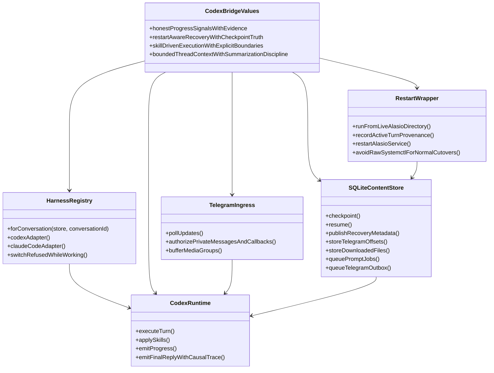
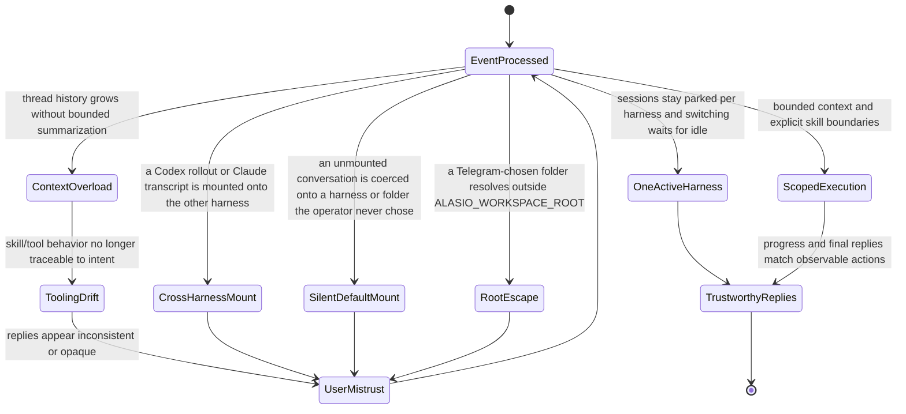

## Concept Atlas
```mermaid
mindmap
  root((alasio))
    Service selection
      alasio drives two harnesses Codex app-server and Claude Code through the Claude Agent SDK behind one harness adapter boundary
      `/service` shows the active harness and both parked session pointers and switches with `Use Codex` or `Use Claude` buttons or `/service codex` and `/service claude`
      each Telegram conversation has at most one active harness and switching is refused while a turn is active or prompts are queued
      conversations are neutral by default so until the operator mounts a service through `/service` every prompt `/start` and harness-scoped control is answered only with the service picker and nothing is queued
      the folder is the layer after the service so once a service is mounted `/workspace` must choose or create the folder the harness works in before any prompt is queued and mounting a service chains straight into the folder picker
      `/workspace` lists top-level folders under `ALASIO_WORKSPACE_ROOT` with git repositories first and `/workspace <name>` mounts one while `/workspace new <name>` creates a git-initialized folder directly under the root
      every folder chosen from Telegram is canonicalized and must stay under the workspace root so symlink and dot-dot escapes are refused and only existing directories mount
      sessions belong to one service and one folder so switching folders parks both harness session pointers and restores whichever were parked for the chosen folder and switching is refused while a turn is active or prompts are queued
      sessions are owned by one harness so the Sessions New Session Rewind and resume controls only ever enumerate and mount the active harness's own session store
      switching parks the current harness session pointer and re-activates the other harness's parked pointer instead of translating sessions across harnesses
      Claude Code turns inherit the local `claude` login so the operator's Claude Code account is used without an API key
      each harness sees the MCP servers the operator configured for it on this machine plus bayma which alasio pins as an npm dependency and launches with its own Node
      `/goal` remains Codex-only because Claude Code has no thread goal primitive and the command says so while Claude Code is active
      `ALASIO_DEFAULT_HARNESS` is unset by default and optionally pre-mounts codex or claude on newly created conversations so they skip the picker
      `WORKING_DIRECTORY` is unset by default and optionally pre-mounts one folder on new conversations and on conversations that predate per-conversation folders so existing deployments keep working unchanged
      `ALASIO_WORKSPACE_ROOT` defaults to the operator home and bounds every folder the picker may list mount or create
      `ALASIO_STATE_DIR` and `ALASIO_HOOK_PORT` place the SQLite state and the localhost hook server so a second alasio instance never shares a database or port with the first and default to `$WORKING_DIRECTORY/.alasio` else `~/.alasio` and 8765
      `ALASIO_CLAUDE_MODEL` `ALASIO_CLAUDE_EFFORT` and `ALASIO_CLAUDE_BIN` are optional Claude Code overrides and default to the CLI's own configuration
    Telegram DM edge behavior
      ingress maps explicitly authorized private Bot API messages and callbacks to a single operator conversation
      egress emits progress edits and Telegram-rendered Markdown final responses in the same direct message stream
      Telegram media groups are buffered briefly so multi-file sends become one Codex turn
    Runtime control plane
      turn orchestrator coordinates execution and interruption boundaries and resolves the conversation's active harness per turn
      each mounted Claude Code session is served by one long-lived Agent SDK process fed through streaming input so every Telegram prompt and Steer is pushed into the same live session and a turn ends on the result that names its prompt
      Claude Code final replies are the SDK result text and intermediate assistant text stays internal commentary
      background shells and agents Claude Code starts keep running after its answer and the turn it starts on its own when they settle holds the conversation busy accepts Steer and is delivered as its own durable reply
      the live Claude Code process is replaced when the mounted session or model changes and closed at shutdown while /stop interrupts only the current turn
      Claude Code runs without the built-in Bash Monitor Grep and Glob tools which are removed from the model's context so shell work and file search go through bayma
      code sent to bayma exec passes a PreToolUse hook that recovers embedded shell commands from Bun shell templates spawn and exec calls and bare command lines then records restart provenance and denies forbidden database commands with the same guardrail guidance
      Codex app-server boundary keeps linked Codex threads warm across Telegram turns
      linked-session warmup is opt-in so service startup and polling are not blocked by Codex resume latency
      Codex SDK exec transport remains an explicit rollback path for runtime isolation
      Codex threads start and resume with overrides that add bayma on top of `$CODEX_HOME/config.toml` and Claude Code queries add bayma to the servers Claude Code loads itself
      skill selection and instruction loading constrain tool behavior
      SQLite content store manages update offsets, conversations, per-harness session pointers, per-folder parked sessions, durable prompt jobs, files, streamed blocks, restart provenance, and resumable continuation
      SQLite Telegram outbox separates Codex completion from rate-limited Bot API delivery
      CI treats Alasio as a Node-native unit target whose semantic source surfaces select exact node:test files in the repository-wide pre-commit gate
    Canonical restart path
      README.md is the source of truth for Alasio operator instructions and AGENTS.md plus CLAUDE.md must remain symlinks to README.md
      Production runs from the isolated `/home/operator/monorepo-alasio-runtime/bots/alasio` deployment checkout while Codex works in `/home/operator/monorepo`
      The standalone checkout at `/home/operator/alasio` runs as `alasio-standalone.service` from `./install-alasio-standalone-service.sh` with its own `.env` `ALASIO_STATE_DIR` and `ALASIO_HOOK_PORT` so it coexists with `alasio.service`
      `.env.example` documents the standalone environment and `.env` stays mode 0600 and untracked because it holds the bot token
      the standalone bot restarts with `./restart-alasio-standalone.sh` from `/home/operator/alasio` which records operator_induced provenance in its own state directory before restarting `alasio-standalone.service`
      `alasio-standalone.service` runs the bot in the `alasio-standalone` container that `container/Dockerfile` builds and `container/run.sh` starts with the host's user, `/home` at the same path (including Homebrew in `/home/linuxbrew`), `/tmp`, network, processes, IPC, Docker, and the environment systemd gives the unit, so the container changes nothing the bot or its agents can do except that host root is out of reach
      `install-alasio-standalone-service.sh` builds that image and installs `systemd/alasio-standalone.rules` as a polkit rule scoped to restarting that one unit so the bot can restart itself without a password, from inside its container through the host's system D-Bus
      the standalone unit sets `ALASIO_SERVICE_UNIT` and `ALASIO_RESTART_WRAPPER` so post-restart prompts name the standalone unit and wrapper instead of the deployment checkout paths
      self-restart detection treats `restart-alasio-standalone.sh` and `systemctl restart alasio-standalone.service` as self-induced the same way as the deployment wrapper
      Normal restarts run from the deployment checkout with `./restart-alasio-operator.sh`
      Equivalent absolute restart path is `/home/operator/monorepo-alasio-runtime/bots/alasio/restart-alasio-operator.sh`
      Wrapper calls from another checkout delegate to the systemd unit WorkingDirectory instead of restarting from source
      Raw `sudo systemctl restart alasio.service` is only a service-level last resort when no active turn provenance must be preserved
    Reliability guarantees
      restart-aware continuation protocol avoids silent context loss and resumes under the harness that owned the interrupted turn
      restart provenance is resolved independently from recovered-output flushing
      shutdown path inspects live descendant commands so self-restarts survive SDK event races
      streamed self-restart detection accepts absolute-path sudo/systemctl variants plus quoted and single-token shell wrappers so shell differences do not silently degrade provenance
      restart near-miss diagnostics trigger only for command-shaped restart attempts against the active systemd service
      operator-triggered restarts use the deployment checkout restart wrapper so outer-shell cutovers persist explicit provenance before systemd stops the unit
      external restarts degrade to explicit unknown provenance instead of falsely attributing them to the user
      tool-pattern guardrails re-enter Codex as internal synthetic user turns instead of fabricating user-visible transport replies
      a once-per-process bayma readiness check and per-harness per-conversation bayma state directories prevent silent no-tool sessions and state-lease contention
      optional startup warmup resumes linked sessions through app-server without creating a new conversation or pruning rollout files
      Telegram New Session creates and mounts a fresh Codex app-server thread instead of only clearing the SQLite session pointer
      Telegram goal objectives with no mounted session create and mount a fresh app-server thread before setting the active goal
      fresh objective goals clear stale upstream thread goal state before setting the active replacement
      Telegram goal controls attach to app-server-created goal turns or start fallback mounted-session turns instead of only updating upstream goal state
      active-turn steering forwards operator guidance through Codex app-server turn/steer before falling back to queueing
      stop and swerve retain conversation ownership until bounded upstream interruption completes
      app-server event silence is not treated as turn failure and remains cancellable through explicit operator control or transport failure
      response handles and notification turn ids remain aliases of one logical turn so either completion identity retires ownership exactly once
      app-server cleanup interrupts record their origin so operator control stale recovery transport failure and consumer exit remain distinguishable
      stale interruption failures recycle only app-server and resume the mounted Codex thread before starting later work
      descendant OOM kills remain contained while main-process exits retain systemd restart recovery
      accepted prompts survive process restarts in a per-conversation SQLite queue
      restart continuations receive deterministic internal prompt identities and retire provenance only with durable queue staging
      Bot API retry-after responses defer durable outbox delivery instead of crashing the service
      Telegram file downloads the Bot API refuses such as anything over its 20 MB getFile limit are reported to the operator and the rest of the message still runs instead of failing the update
      the update poller records every raw update before processing and advances past one whose processing throws so a single poison update cannot wedge polling
      upstream turn completion is checkpointed separately from Telegram delivery so restart recovery cannot duplicate completed work
      terminal response handoff retries continue during normal service uptime rather than waiting for another restart
      final replies contain only Codex final-answer phase text while commentary tool activity and phase-less text remain internal
      durable terminal markers prevent active streams from becoming recoverable output before upstream completion
      one outbox identity per terminal response makes live handoff and restart recovery converge on the same delivery
      observable action to reply consistency prevents fabricated completion signals
      Codex-native compaction remains the source of truth for long conversations
    Historical emphasis
      recent changes prioritized restart recovery, Codex-native compaction, and truthful status messaging
      service prompt/hook integration aims for deterministic operational handoffs
```

## Preference Atlas


## Avoidance Atlas

