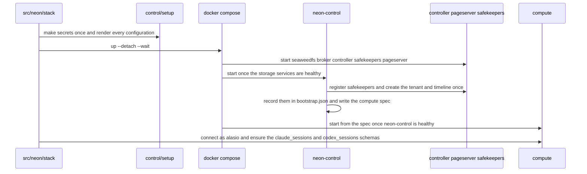
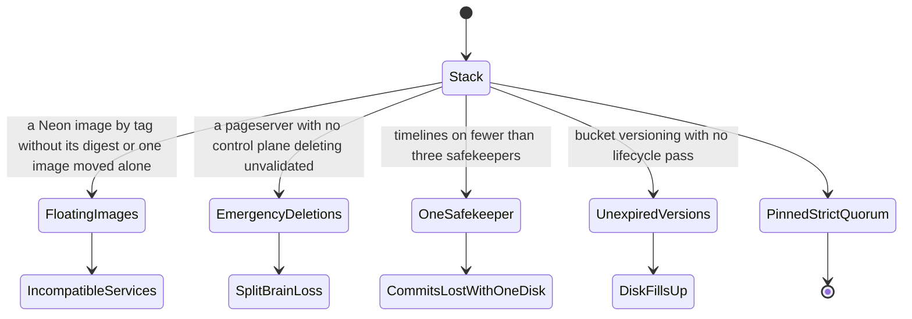

## Concept Atlas
```mermaid
mindmap
  root((neon))
    What it is
      alasio's own Neon is Neon's open-source storage engine run on this machine as the docker compose project `alasio-neon` described by compose.yml and it keeps Claude Code's transcripts and Codex's rollout files
      it is frozen at neon release-9129 and compute release-compute-9073 on Postgres 17.5 with every image pinned by digest so nothing about it changes unless alasio changes it
      src/neon/stack.js brings it up before alasio serves anything and Docker's restart policies keep every service running across crashes and reboots
      everything talks on the stack's private network and only the compute is published on 127.0.0.1 port 55433
      that network's Linux bridge is named alasio-neon0 for alasio's own stack and a name derived from the project for a test stack so host tooling and firewall rules can name the interface the stack and its session hosts share across the network being recreated
    Services
      seaweedfs is the S3 Neon stores into with one bucket `neon` versioned and fsynced on one volume and seaweedfs-init makes that idempotently on every start and also makes the unversioned `sessions` bucket the session-filesystem volumes' data lives in
      seaweedfs-lifecycle-init expires the pageserver's replaced object versions after seven days as Neon's own point-in-time window does and the safekeepers' after one day since each safekeeper re-uploads the WAL segment it is still writing whole as it grows and nothing reads the copies it replaces and seaweedfs-lifecycle runs those rules every six hours because SeaweedFS applies lifecycle rules only when asked
      valkey is the JuiceFS metadata engine for session filesystems (session-fs-research E12) append-only durable and noeviction with one logical DB per volume reached as valkey:6379 by the session hosts that join this project's network and it is idle unless ALASIO_SANDBOX_ENABLED is set — src/sandbox is the subsystem that uses it
      storage-broker carries timeline state between safekeepers and the pageserver
      storage-controller runs in strict mode on its own Postgres controller-db places the tenant and puts every timeline on three safekeepers and validates every deletion the pageserver makes
      safekeeper-1 safekeeper-2 and safekeeper-3 are the WAL quorum so a commit returns once two of them have it and each offloads WAL to seaweedfs
      pageserver serves pages to the compute from WAL and layer files it uploads to seaweedfs and registers itself with the controller from metadata.json
      neon-control is the control plane a Node service in control/service.js that registers the safekeepers creates the tenant and timeline once writes the compute's spec and every thirty seconds rebuilds any safekeeper that lost its timeline from a healthy peer
      compute is Postgres with the neon extension started by compute_ctl from that spec holding the `alasio` database and role
      backup writes a pg_dump of the `alasio` database every day into backups and keeps the last fourteen
    Security
      control/setup.js makes every secret once on first start under the alasio state directory and renders every service's configuration from them on every start
      the services authenticate to each other with EdDSA JWTs signed by one key whose private half only the host keeps in `neon/secrets` mode 0700
      alasio reaches the compute as role `alasio` with a SCRAM password from `neon/secrets/alasio-database-url`
      Neon writes to seaweedfs with credentials limited to the `neon` bucket and only the lifecycle setup uses the admin identity and the session filesystems write with a third identity limited to the `sessions` bucket
      the session-filesystem secrets are made here too the Valkey password which is its requirepass and a file the session hosts read and the `sessions` S3 key and secret as files the alasio process points its ALASIO_SANDBOX_S3_*_FILE knobs at
    State
      everything lives under `<ALASIO_STATE_DIR>/neon` with secrets keys compose.env seaweedfs controller-db pageserver safekeeper-1 to 3 control backups and valkey
      control/bootstrap.json records the tenant the timeline and which safekeepers hold it at which generation and is what makes bootstrapping idempotent
      the stack shares the machine's disk and degrades as it fills: SeaweedFS stops accepting writes with less than 5 GiB free so layer uploads and WAL offload stall until space is freed while the pageserver past 80% use evicts local layers it can fetch again from S3 and a test stack from npm run test:neon needs a few GB of its own
      durability is one disk so the safekeeper quorum and S3 versioning survive process crashes and a lost service directory but not the loss of the machine's disk and backups are local too
    Operations
      state `docker compose --project-name alasio-neon --file neon/compose.yml --env-file <state>/neon/compose.env ps` and swap `ps` for `logs <service>` `restart <service>` `stop` or `up --detach --wait`
      transcripts are searched with claude_sessions.search which src/harness/claude/search describes
      transcripts are queried in SQL through claude_sessions.entries.doc the jsonb copy of each entry since Postgres's JSON operators fail on the entry column wherever an entry holds a NUL or half a surrogate pair
      Codex's rollout files are kept byte for byte in codex_sessions.rollouts and codex_sessions.rollout_chunks which src/codex/rollouts describes
      a restore takes the newest dump from backups into any Postgres 17 with `pg_restore --clean --if-exists` and alasio needs only its `claude_sessions` and `codex_sessions` schemas
      a safekeeper whose directory is lost is repaired by neon-control within thirty seconds of starting again by pulling the timeline from a peer
      a past moment is read by asking the pageserver's `get_lsn_by_timestamp` for its LSN and starting a second compute from the same spec with mode Static at that LSN and no safekeepers as neon/test/stack.test.js does
      a change to neon-control's code changes ALASIO_NEON_CONTROL_REVISION in compose.env so the next start recreates neon-control and the compute whose spec it writes
      an upgrade moves every Neon image to one newer release together then runs `npm run test:neon` before alasio runs it because Neon publishes no compatibility promise for self-hosting
      the cost of owning it is that Neon's hosted control plane is replaced by neon-control so a Neon release that changes the storage controller's safekeeper or compute APIs needs neon-control changed with it
    Tests
      `npm run test:neon` brings a throwaway stack up from nothing through startNeon runs the session store conformance suite on its compute and proves nothing committed is lost through a full stop and start and through a SIGKILL of the pageserver a safekeeper the compute the storage controller or seaweedfs mid-write
      it also proves that a change to neon-control's code recreates exactly neon-control and the compute
      it also proves a safekeeper that lost its disk is rebuilt garbage the pageserver collects is deleted only after the controller validates it the daily dump restores and the database reads as it was at a past moment
```

## Preference Atlas


## Avoidance Atlas

