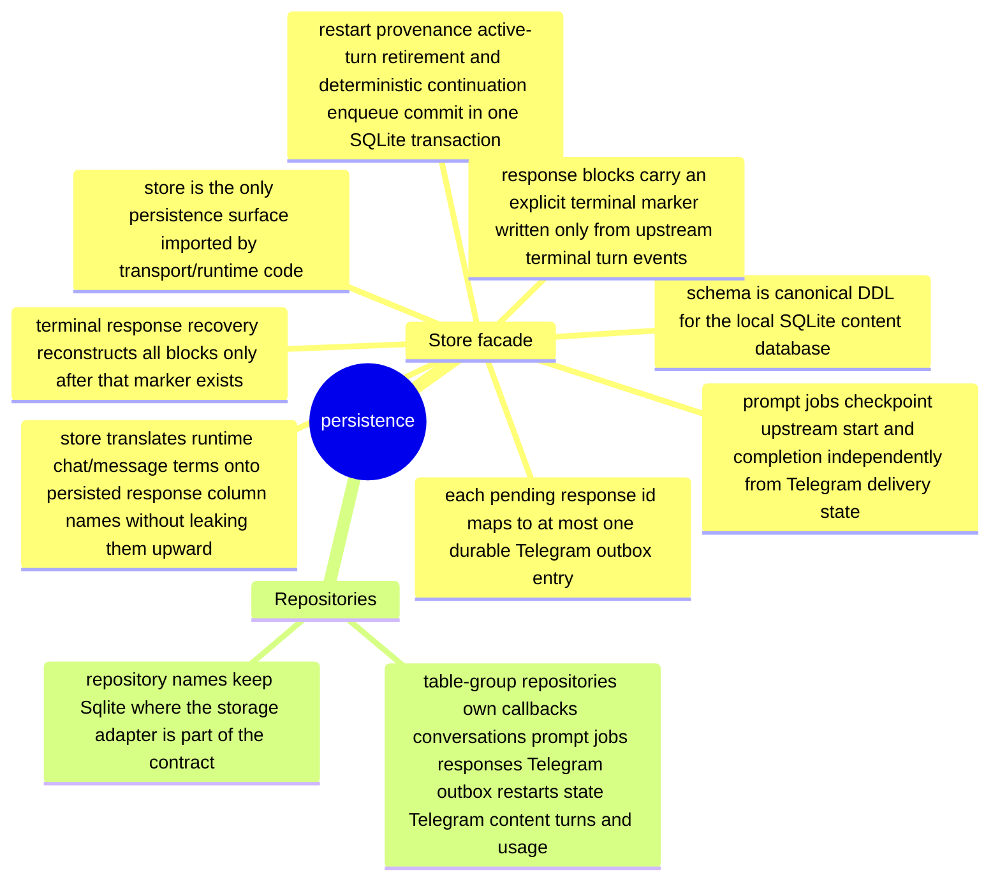
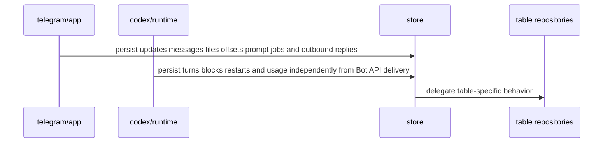
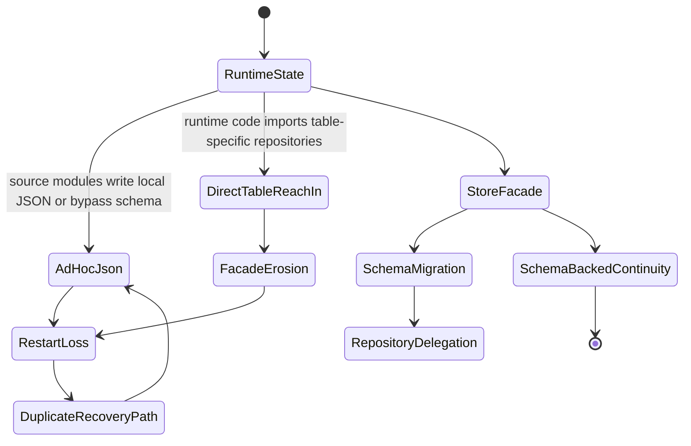

## Concept Atlas

```mermaid
mindmap
  root((persistence))
    Store facade
      store is the only persistence surface imported by transport/runtime code
      schema is canonical DDL for the local SQLite content database
      prompt jobs checkpoint upstream start and completion independently from Telegram delivery state
      restart provenance active-turn retirement and deterministic continuation enqueue commit in one SQLite transaction
      response blocks carry an explicit terminal marker written only from upstream terminal turn events
      terminal response recovery reconstructs all blocks only after that marker exists
      each pending response id maps to at most one durable Telegram outbox entry
      store translates runtime chat/message terms onto persisted response column names without leaking them upward
    Repositories
      table-group repositories own callbacks conversations prompt jobs responses Telegram outbox restarts state Telegram content turns and usage
      repository names keep Sqlite where the storage adapter is part of the contract
```

## Preference Atlas

```mermaid
sequenceDiagram
  participant App as telegram/app
  participant Runtime as codex/runtime
  participant Store as store
  participant Repo as table repositories
  App->>Store: persist updates messages files offsets prompt jobs and outbound replies
  Runtime->>Store: persist turns blocks restarts and usage independently from Bot API delivery
  Store->>Repo: delegate table-specific behavior
```

## Avoidance Atlas

```mermaid
stateDiagram-v2
  [*] --> RuntimeState
  RuntimeState --> AdHocJson: source modules write local JSON or bypass schema
  AdHocJson --> RestartLoss
  RestartLoss --> DuplicateRecoveryPath
  DuplicateRecoveryPath --> AdHocJson
  RuntimeState --> DirectTableReachIn: runtime code imports table-specific repositories
  DirectTableReachIn --> FacadeErosion
  FacadeErosion --> RestartLoss
  RuntimeState --> StoreFacade
  StoreFacade --> SchemaMigration
  SchemaMigration --> RepositoryDelegation
  StoreFacade --> SchemaBackedContinuity
  SchemaBackedContinuity --> [*]
```
